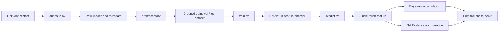

# TouchLab VTS

TouchLab VTS is a desktop research toolkit for collecting, processing, and
classifying visuo-tactile contacts from GelSight-style sensors. The project
supports the full experimental pipeline:

1. Capture tactile images and annotate local geometric features.
2. Export leakage-resistant train, validation, and test datasets.
3. Train a ResNet-18 local-feature encoder.
4. Predict a local feature from each tactile contact.
5. Accumulate multiple contacts with Bayesian or set-based shape evidence.

The current primitive object classes are `cube`, `sphere`, `cylinder`, `cone`,
and `square_pyramid`. The local tactile vocabulary is:

- `planar`
- `single_curvature`
- `double_curvature`
- `straight_edge`
- `circular_rim`
- `multi_face_vertex` (metadata may use the alias `multiface_vertex`)
- `sharp_apex`

## System Overview



`annotate.py` and `predict.py` share the same sensor-processing pipeline. It
can display the raw camera stream, contact heatmap, optical-flow deformation,
and a Poisson-integrated height reconstruction. Sensor and processing settings
are stored as JSON rather than hardcoded into the algorithms.

## Requirements

- Windows is the primary supported platform. Camera capture uses OpenCV and
  requests the DirectShow backend for integer camera sources.
- Python 3.11 is the intended environment.
- A GelSight Mini or another camera-compatible visuo-tactile sensor.
- PyTorch and torchvision for training and prediction.
- A CUDA-capable GPU is optional. Training and inference fall back to CPU.
- Tk must be included with the Python installation.

The checked-in `requirements.txt` is an environment snapshot containing Python,
CUDA, and Windows runtime packages. It is not a minimal portable pip lock file.
For a fresh virtual environment, install the application-level packages first:

```powershell
python -m venv .venv
.\.venv\Scripts\Activate.ps1
python -m pip install --upgrade pip
python -m pip install numpy scipy matplotlib pillow opencv-python scikit-learn tqdm torch torchvision
```

Install the PyTorch build appropriate for the machine when CUDA support is
required.

## Quick Start

Run commands from the repository root.

### 1. Configure a sensor

Sensor profiles live in `config/<sensor-name>.json`. Each profile contains the
camera source and its contact, flow, reconstruction, capture, and dashboard
settings. `config/config.json` stores the last selected sensor.

Start the annotation application:

```powershell
python annotate.py
```

Use **Settings** to select or manage the sensor, capture a clean background,
and choose which derived images should be saved.

### 2. Collect annotated contacts

In `annotate.py`:

1. Select the base dataset folder.
2. Enter the object label.
3. Set the custom fields, especially `local_feature`.
4. Use **Single Image** to save one contact or **Video Sequence** to record a
   contact while its detected area exceeds the configured threshold.

The custom-field vocabulary is configured in `config/custom_fields.json` and
can also be edited from the application.

### 3. Export an ML dataset

```powershell
python preprocess.py
```

The exporter scans `*metadata.json` files and can categorize images by the
object `label` or by `custom_fields.local_feature`. Select the feature suffix to
export, such as `raw.png`, and choose train/validation/test ratios.

Video frames from one acquisition are kept in the same split. This grouped
split prevents nearly identical frames from one touch sequence leaking across
training and evaluation sets. Augmentations are applied only to the training
split.

### 4. Train the local-feature encoder

```powershell
python train.py --dataset_dir ml_dataset --epochs 20 --batch_size 32
```

Useful options:

| Option | Default | Purpose |
| --- | ---: | --- |
| `--dataset_dir` | `ml_dataset` | Dataset containing `train`, `val`, and `test` |
| `--epochs` | `20` | Maximum training epochs |
| `--batch_size` | `32` | DataLoader batch size |
| `--lr` | `0.001` | Adam learning rate |
| `--output_dir` | `train` | Parent folder for timestamped runs |
| `--patience` | `5` | Validation-loss early-stopping patience |

Training uses an ImageNet-initialized ResNet-18, replaces its final layer, and
saves a timestamped run containing:

- `best_resnet18_model.pth`
- `labels.txt`
- `training_history.png`
- `classification_report.json`
- `classification_report.txt`
- `confusion_matrix.png`

### 5. Deploy a trained encoder

`predict.py` requires a weights file and same-stem label file:

```text
models/pth/features.pth
models/pth/features.txt
```

Optional same-stem sidecars are:

```text
models/pth/features.calibration.json  # encoder temperature scaling
models/pth/features.rfs.json          # model-specific Set Evidence config
```

Copy or rename both the trained `.pth` file and its `labels.txt` so their stems
match. The number and order of labels must match the model output layer.

### 6. Run prediction and multi-touch recognition

```powershell
python predict.py
```

The application provides:

- **Predict**: one-contact local-feature probabilities.
- **Multi Touch**: one selected shape algorithm updated after each contact.
- **Compare**: side-by-side Bayesian and Set Evidence results.
- **Settings**: shared sensor, contact, timing, flow, and height controls.

The AI model selector is shared by all prediction views. A touch is accepted
after its contact area remains above the configured threshold for the capture
timer duration.

## Dataset Format

Annotation data is stored by sensor, object, and capture mode:

```text
dataset/
  GelSight/
    cone/
      image/
        0000_raw.png
        0000_metadata.json
      video/
        sequence_001/
          sequence_001_frame_0000_raw.png
          sequence_001_frame_0000_metadata.json
```

A metadata file records the object, sensor, acquisition mode, contact area,
saved feature files, and custom fields:

```json
{
  "sensor": "GelSight",
  "label": "cone",
  "capture_mode": "Video",
  "contact_area_pixels": 8233,
  "is_video_sequence": true,
  "sequence_name": "sequence_001",
  "saved_features": ["sequence_001_frame_0000_raw.png"],
  "custom_fields": {
    "size": "small",
    "local_feature": "sharp_apex"
  }
}
```

The exported training structure follows torchvision `ImageFolder` conventions:

```text
ml_dataset/
  train/<class>/*.png
  val/<class>/*.png
  test/<class>/*.png
  labels.txt
  split_manifest.json
```

`split_manifest.json` records acquisition group assignments and the fixed split
seed (`42`) for reproducibility.

## Shape Algorithms

Shape algorithms are registered in `algorithms/registry.py`. Predict discovers
the registry dynamically, so a newly registered algorithm appears in the
Multi Touch and Compare views without another hardcoded UI list.

### Bayesian baseline

`algorithms/bayesian/algorithm.py` performs a sequential Bayesian update from
the encoder's highest-probability local-feature label. Its active likelihood
table is `algorithms/bayesian/config.json`.

Launch the Bayesian data and optimization tool with:

```powershell
python tools/optimize_bayesian.py
```

The tool can:

- Record manually explored touch sequences.
- Scan annotation metadata for unique local features per object class.
- Edit the class-specific feature vocabulary used for generation.
- Generate reproducible random touch sequences.
- Optimize `P(feature | shape)` with gradient descent.
- Save immutable timestamped run artifacts and update the active config.

Randomly generated combinations are useful for software development. Physical,
independently collected trials are required for defensible performance claims.

### Set Evidence (RFS-inspired)

`algorithms/rfs/` implements hard-label, permutation-invariant evidence
accumulation for unordered handheld contacts. The UI name is **Set Evidence**
because this is inspired by Random Finite Set reasoning but is not a complete
multi-target RFS filter.

For a contact set, the algorithm combines:

- Average log compatibility with each shape's feature-frequency template.
- Binary feature coverage, so repeated observations do not inflate diversity.
- Penalties for observed features that are unexpected for a shape.
- Shape priors and calibrated score temperature.
- Confidence, entropy, minimum-touch, stability, and maximum-touch stopping.

The default schema-v2 configuration is `algorithms/rfs/config.json`. Set
Evidence consumes only the encoder's top feature label. It deliberately ignores
the encoder softmax confidence and its temperature-calibration sidecar.

Core fitting and evaluation APIs are available in:

- `algorithms.rfs.fitting.fit_rfs_config`
- `algorithms.rfs.evaluation.evaluate_rfs_trials`
- `algorithms.rfs.trials.append_trial`

There is currently no standalone RFS fitting CLI. Use these APIs from Python or
add a dedicated tool before documenting a command-line workflow.

See `algorithms/rfs/README.md` for equations and configuration semantics.

### Adding another algorithm

1. Create `algorithms/<name>/` with an `__init__.py` and implementation module.
2. Expose a state update method returning normalized beliefs or a result object.
3. Add one `register_algorithm(...)` call to `algorithms/registry.py`.

The registry accepts either `hard_label` or `probabilities` input adapters. See
`algorithms/README.md` for the complete contract.

## Calibration

There are three distinct kinds of calibration in this repository:

1. **Live tactile baseline and height calibration** in `annotate.py` and
   `predict.py`. These controls estimate the background, gradient offsets, and
   height zero used by tactile visualization.
2. **Camera intrinsic calibration** in `tools/calibrate.py`. This detects a
   chessboard, estimates camera and distortion matrices, previews
   undistortion, and exports JSON and Markdown reports.
3. **Encoder probability calibration** in `tools/model_calibration.py`. This
   provides temperature scaling plus NLL, ECE, Brier score, and accuracy
   metrics. `predict.py` loads `<model>.calibration.json` when present.

Run the camera calibration UI with:

```powershell
python tools/calibrate.py
```

`tools/model_calibration.py` is a library module, not a command-line program.

## Configuration Reference

| Path | Purpose |
| --- | --- |
| `config/config.json` | Last selected sensor name |
| `config/<sensor>.json` | Camera source and sensor-processing settings |
| `config/custom_fields.json` | Annotation metadata field definitions |
| `algorithms/bayesian/config.json` | Active Bayesian likelihood table |
| `algorithms/rfs/config.json` | Default Set Evidence templates and parameters |
| `<model>.txt` | Encoder class labels in output-index order |
| `<model>.calibration.json` | Optional encoder temperature calibration |
| `<model>.rfs.json` | Optional model-specific Set Evidence configuration |

## Testing

The test suite covers grouped dataset splitting, algorithm registration,
Bayesian artifact paths and generated sequences, Set Evidence equations and
permutation invariance, RFS configuration/fitting/evaluation/trial persistence,
and model temperature calibration.

```powershell
python -m unittest discover -s tests -v
```

PyTorch must be installed because the model-calibration tests import it.

## Project Layout

```text
Touchlab-VTS/
  annotate.py                 Current annotation and data-capture application
  preprocess.py               Metadata scanner and grouped dataset exporter
  train.py                    ResNet-18 training and evaluation
  predict.py                  Single- and multi-touch prediction application
  visualize.py                Earlier all-in-one visualization/capture UI
  algorithms/
    registry.py               Dynamic shape-algorithm registry
    bayesian/                 Bayesian baseline, optimizer artifacts, configs
    rfs/                      Set Evidence config, fitting, trials, evaluation
  config/                     Sensor profiles and annotation fields
  dataset/                    Raw and exported datasets (gitignored)
  documents/                  Dissertation, algorithm, and speaker notes
  models/
    resnet18.py               Standalone ResNet helper module
    pth/                      Deployed weights and model sidecars (gitignored)
  tests/                      Unit tests
  tools/
    calibrate.py              Camera intrinsic calibration UI
    dataset_splitting.py      Acquisition-group-aware splitting
    model_calibration.py      Temperature scaling and calibration metrics
    optimize_bayesian.py      Bayesian sequence generator and optimizer
  train/                      Timestamped training runs
```

## Research Documentation

The `documents/` folder contains the longer research treatment:

- `TouchRFS_algorithm_note.md`: paper-style algorithm and experimental design.
- `TouchRFS_speaker_script.md`: accessible project and mathematics walkthrough.
- `Dissertation_Methodology_Bayesian_and_Set_Evidence.md`: detailed methodology.
- `Set_Evidence_Parameter_Optimization_Guide.md`: parameter-estimation strategy.

Implementation behavior is defined by the Python code and schema-v2 JSON
configuration. Some research notes describe earlier probability-weighted
variants, so check `algorithms/rfs/README.md` and the current tests when the two
differ.

## Notes

- `dataset/`, `models/`, and Python cache files are ignored by Git.
- The live applications use background threads for camera processing; close
  them through the window controls so the camera handle is released cleanly.
- Keep training, validation, and test acquisition groups independent. Do not
  evaluate on random frame-level splits of the same recorded touch sequence.
