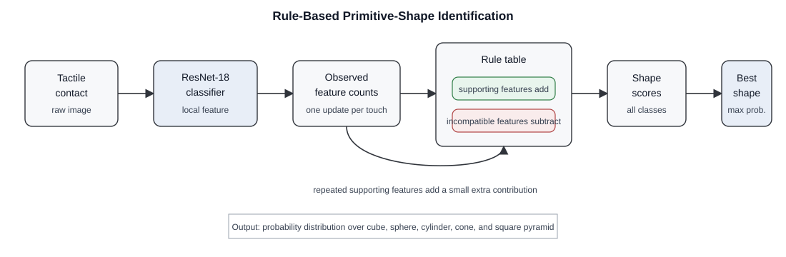

# Methodology

This study learns local geometric features from individual visuo-tactile contacts and uses them as pose-free evidence for primitive-shape recognition. The pipeline starts with contact acquisition, stores each tactile image with metadata, assigns a local geometric label, prepares grouped training partitions, fine-tunes a convolutional classifier, and uses predicted local features to support shape identification.

```text
contact acquisition -> metadata and annotation -> grouped split
                    -> preprocessing and augmentation -> ResNet-18 training
                    -> local feature prediction -> primitive-shape decision
```

**Algorithm 1.** Pose-free local geometric feature learning.

```text
Input: Tactile image set with object and local-feature annotations
Output: Trained local geometric feature classifier

1. Capture tactile images from primitive-shape contacts.
2. Save each image with its acquisition metadata and annotation.
3. Remove samples without valid images or local geometric labels.
4. Split samples by acquisition group into training, validation, and test sets.
5. Resize images and apply augmentation to the training set.
6. Replace the final layer of ResNet-18 with a seven-class output layer.
7. Fine-tune the network and keep the checkpoint with the lowest validation loss.
8. Predict the local geometric feature from each tactile image.
```

## 3.1 Hardware and Contact Collection

The hardware setup uses a GelSight Mini optical tactile sensor, shown in Figure 1. The sensor records deformation of its compliant elastomer as a raw tactile image during contact.

**Figure 1.** GelSight Mini optical tactile sensor used for visuo-tactile contact acquisition.

Collection is automated by comparing each frame with a background reference, thresholding the difference image, and filtering the resulting contact mask, as shown in Figure 2. When the contact area exceeds a user-defined threshold, the application saves the image and metadata; capture stops after the contact area falls below the threshold. This supports repeated touches at different locations and angles with minimal manual intervention.

**Figure 2.** Example raw tactile image and corresponding thresholded contact mask used for automatic contact detection.

## 3.2 Primitive Shapes and Local Features

The dataset includes five primitive shapes: cube, sphere, cylinder, cone, and square pyramid. Because each shape is contacted at different locations and orientations, the classifier is trained on local contact geometry rather than full-object appearance.

**Table 1.** Primitive shapes and expected local features.

| Primitive shape | Expected local features |
|---|---|
| Cube | Planar surfaces, straight edges, and multi-face vertices |
| Sphere | Double-curvature surface regions |
| Cylinder | Planar ends, single-curvature side regions, and circular rims |
| Cone | Planar base, single-curvature side regions, circular rim, and sharp apex |
| Square pyramid | Planar faces, straight edges, multi-face vertices, and sharp apex |

The seven local feature classes are planar contact, single-curvature contact, double-curvature contact, straight edge, circular rim, multi-face vertex, and sharp apex. These classes describe the geometry visible within one tactile contact patch and are assigned independently of the full primitive-shape label.

## 3.3 Annotation and Dataset Preparation

Each sample is stored with a JSON metadata record containing the acquisition conditions, contact measurement, sequence information, and annotation fields. Specifically, the metadata includes:

- acquisition timestamp, sensor name, capture mode, and difference method;
- frame scale, measured contact area, and automatic capture threshold;
- video-sequence flag, sequence name, and saved raw-image filename;
- primitive-shape label, object size, and local geometric label.

The primitive-shape label identifies the contacted object, while the local geometric label is used as the supervised training target.

The preprocessing script scans the metadata, resolves the saved raw images, removes incomplete samples, and exports the dataset by local feature class. Samples are split into training, validation, and test sets using an 80/10/10 ratio with a fixed seed of 42. The split is performed by acquisition group, so all frames from the same video sequence remain in the same partition.

Images are resized to 256 x 256 pixels before model input. Training images are augmented using random rotation within +/-15 degrees, horizontal flipping, and vertical flipping. Validation and test images use the same resizing without augmentation, and all images are normalized using ImageNet channel statistics.

## 3.4 Network Training

The classifier uses ResNet-18 initialized with ImageNet weights. Its final fully connected layer is replaced with a seven-class output layer corresponding to the local geometric feature classes. The full network is fine-tuned so that low-level visual filters from natural images are adapted to tactile deformation patterns.

Training uses categorical cross-entropy, Adam optimization with a learning rate of 0.001, and a batch size of 32. A step scheduler reduces the learning rate by a factor of 0.1 after seven epochs. Training is limited to 20 epochs and stops early if validation loss does not improve for five consecutive epochs. The checkpoint with the lowest validation loss is retained for local feature prediction.

## 3.5 Touch-Based Shape Identification

After training, each new tactile image is passed through the ResNet-18 classifier to obtain a predicted local feature. Shape identification is performed using a rule-based classifier that accumulates the predicted features across touches. The classifier maintains a count for each observed feature and evaluates every primitive shape using a predefined rule table. Features that are expected for a shape increase its score, while features that are physically inconsistent with that shape decrease its score. Repeated supporting observations add a small contribution, so multiple contacts can strengthen the decision without allowing duplicate frames to dominate. The final shape scores are converted into probabilities, and the shape with the highest probability is selected.

For the confidence-curve test, touches are simulated as unique local features from the expected feature set of each primitive shape. A decision is accepted only when the predicted shape reaches at least 90% confidence after the required minimum number of touches: two for the sphere and three for the other primitive shapes.



**Figure 3.** Rule-based primitive-shape identification from predicted local tactile features.

**Algorithm 2.** Rule-based primitive-shape identification from tactile contacts.

```text
Input: Trained local-feature classifier, rule table, tactile contacts
Output: Shape probability distribution and predicted primitive shape

1. Initialize the observed-feature counts and equal shape priors.
2. For each tactile contact:
   a. Capture the raw tactile image.
   b. Predict the local geometric feature using the trained ResNet-18 model.
   c. Update the count for the predicted feature.
3. For each primitive shape:
   a. Add rule weights for observed features that support the shape.
   b. Subtract rule weights for observed features that contradict the shape.
   c. Add a small repeated-feature contribution for repeated supporting evidence.
4. Convert the shape scores into probabilities.
5. Select the primitive shape with the highest probability.
```
