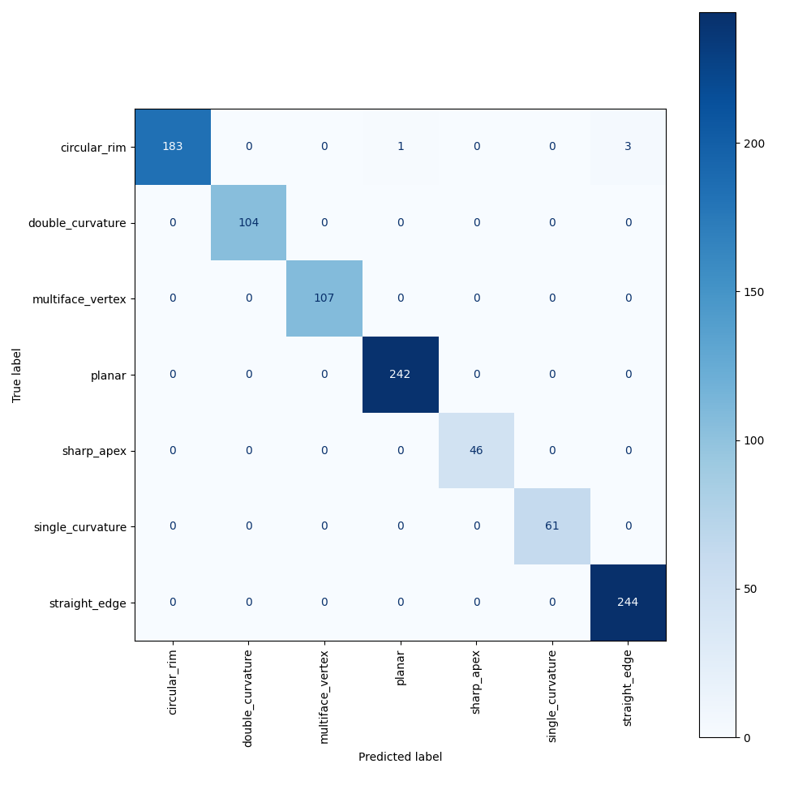
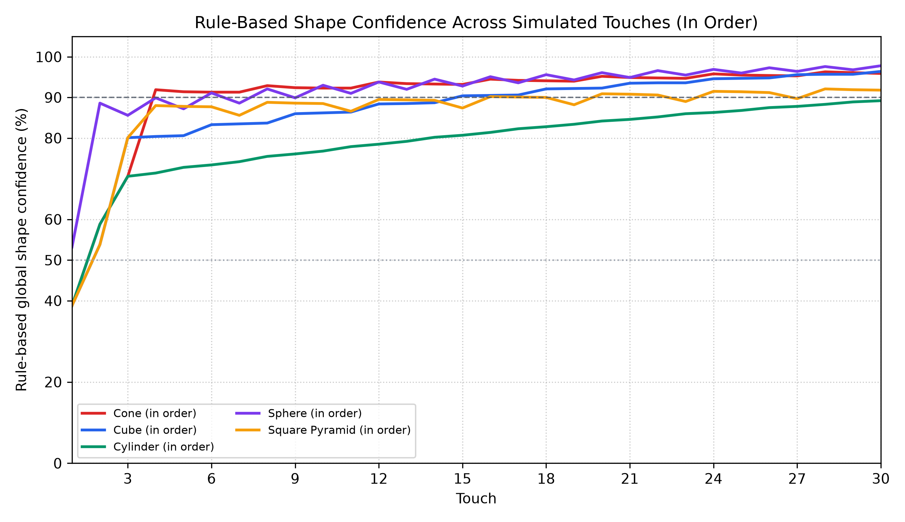
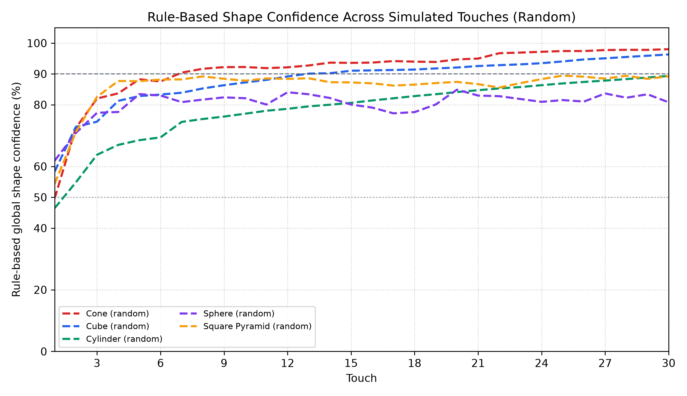
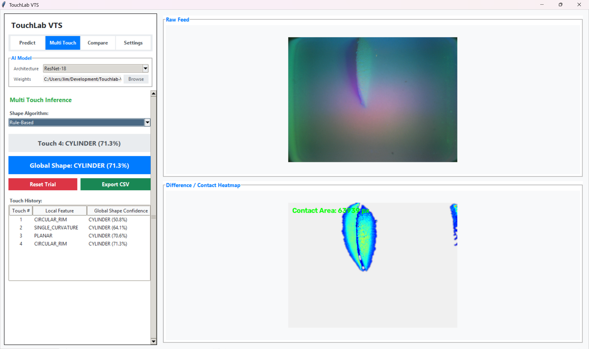

# Results and Discussion

## 4.1 Dataset Summary

The collected dataset contains visuo-tactile contacts from five primitive shapes: cube, sphere, cylinder, cone, and square pyramid. Each contact was labeled according to the local geometry visible in the tactile image, producing seven feature classes: planar contact, single-curvature contact, double-curvature contact, straight edge, circular rim, multi-face vertex, and sharp apex. Samples were exported by local feature class and split by acquisition group, so frames from the same contact sequence were not shared across training, validation, and test partitions. The held-out feature-classification test set contained 991 tactile images.

**Table 2.** Held-out test-set distribution by local feature.

| Local feature | Test samples | Share |
|---|---:|---:|
| Circular rim | 187 | 18.9% |
| Double curvature | 104 | 10.5% |
| Multi-face vertex | 107 | 10.8% |
| Planar contact | 242 | 24.4% |
| Sharp apex | 46 | 4.6% |
| Single curvature | 61 | 6.2% |
| Straight edge | 244 | 24.6% |
| **Total** | **991** | **100.0%** |

## 4.2 Local Feature Classification Results

The ResNet-18 classifier achieved 99.60% accuracy on the held-out test set. As shown in Table 3, macro-averaged precision, recall, and F1-score were 99.77%, 99.69%, and 99.73%, respectively, while the weighted F1-score was 99.60%. The close agreement between macro and weighted scores indicates that performance was not dominated only by the larger planar-contact and straight-edge classes.

**Table 3.** Local geometric feature classification performance.

| Local feature | Precision | Recall | F1-score | Support |
|---|---:|---:|---:|---:|
| Circular rim | 1.000 | 0.979 | 0.989 | 187 |
| Double curvature | 1.000 | 1.000 | 1.000 | 104 |
| Multi-face vertex | 1.000 | 1.000 | 1.000 | 107 |
| Planar contact | 0.996 | 1.000 | 0.998 | 242 |
| Sharp apex | 1.000 | 1.000 | 1.000 | 46 |
| Single curvature | 1.000 | 1.000 | 1.000 | 61 |
| Straight edge | 0.988 | 1.000 | 0.994 | 244 |

The table shows near-perfect recognition for most local geometric classes. Double curvature, multi-face vertex, sharp apex, and single curvature reached perfect precision and recall. Planar contact and straight edge reached full recall, with small precision reductions caused by circular-rim samples being assigned to those classes. Circular rim was the only class with reduced recall, correctly classifying 183 of 187 samples.

## 4.3 Confusion Matrix Analysis

The confusion matrix in Figure 4 shows that all four feature-classification errors came from circular-rim contacts. One circular-rim sample was predicted as planar contact, and three were predicted as straight edge; no other class produced false negatives.

**Figure 4.** Confusion matrix for local geometric feature classification on the held-out test set.

This error pattern is consistent with the local nature of tactile images. A partial rim can appear planar when the curved boundary is weak, or edge-like when only a short arc is visible within the contact patch. The confusion therefore suggests a localized geometric ambiguity rather than broad failure of the learned representation.

## 4.4 Rule-Based Shape Identification

The learned local-feature classifier was then used as the front end for rule-based primitive-shape identification. Each touch first produced a predicted local feature. The rule-based classifier accumulated the predicted feature counts, evaluated every primitive shape using positive and negative feature rules, converted the resulting scores into probabilities, and selected the shape with the highest probability.

Rule-based shape identification was evaluated using feature-level touch trials. Each primitive shape was tested with five trials of 30 touches under two ordering conditions: in-order feature presentation and random feature presentation. This protocol isolates the behavior of the shape-decision logic after local features have been identified.

**Table 4.** Rule-based confidence behavior across five 30-touch trials.

| Primitive shape | In-order first >=90% touch | In-order final confidence | Random first >=90% touch | Random final confidence |
|---|---:|---:|---:|---:|
| Cone | 4 | 95.9% | 7 | 98.0% |
| Cube | 15 | 96.4% | 13 | 96.3% |
| Cylinder | >30 | 89.2% | >30 | 89.3% |
| Sphere | 6 | 97.8% | >30 | 80.8% |
| Square pyramid | 16 | 91.8% | >30 | 89.2% |

**Figure 5.** Rule-based primitive-shape confidence curves under in-order touch trials.

**Figure 6.** Rule-based primitive-shape confidence curves under random touch trials.

**Figure 8.** TouchLab VTS interface for multi-touch inference, showing the raw tactile image, contact heatmap, accumulated global shape confidence, and touch-level prediction history.

For the in-order condition, Table 4 and Figure 5 show that confidence increased in a structured manner as complementary local features were introduced. Cone reached 90% confidence by the fourth touch, while sphere reached this threshold by the sixth touch. Cube and square pyramid required longer evidence accumulation, reaching the threshold at the fifteenth and sixteenth touches, respectively. Cylinder remained below 90% after 30 touches, although the final prediction was correct, indicating that its evidence profile was less distinctive because single curvature and circular rim are also compatible with cone-like geometry.

For the random condition, Table 4 and Figure 6 show slower and less uniform convergence. Cone and cube still exceeded 90% confidence, but sphere, cylinder, and square pyramid ended below the threshold despite correct final predictions. This pattern indicates that the rule-based stage is sensitive to feature order: repeated or weakly discriminative contacts can delay confidence growth, while distinctive contacts accelerate convergence when they appear early. The interface in Figure 8 supports this analysis by displaying each local-feature prediction beside the updated global shape confidence, making the effect of each additional touch visible during inference. The 90% threshold should therefore be interpreted as a confidence criterion rather than a strict correctness boundary. Overall, the rule-based results show that accumulated local tactile evidence can support transparent primitive-shape decisions, but additional weighting or active touch selection may be needed for geometries with shared local features.

## 5 Conclusion

This work presented a pose-free visuo-tactile approach for primitive-shape recognition based on local geometric feature learning. Using a GelSight Mini sensor, contact images were collected from primitive objects and represented through local tactile features such as planar contact, curvature, edge, rim, vertex, and apex. This design avoids requiring complete object pose or full-surface reconstruction and instead uses repeated local contacts as the basis for object-level recognition.

The ResNet-18 local feature classifier achieved 99.60% accuracy on the held-out test set, with macro-averaged precision, recall, and F1-score of 99.77%, 99.69%, and 99.73%, respectively. Errors were limited to circular-rim contacts, which were occasionally classified as planar contact or straight edge, indicating that most feature classes were well separated while partial rim contacts remained locally ambiguous.

The rule-based identification stage produced correct final primitive-shape predictions across five 30-touch trials for each shape under both in-order and random feature presentations. The confidence curves showed that recognition confidence depends on feature distinctiveness and touch order: cone and sphere converged more quickly when discriminative contacts appeared early, while cylinder and square pyramid required more accumulated evidence. Future work will extend the method to larger object sets, improve confidence calibration, and incorporate active touch selection for more efficient tactile recognition.

## Acknowledgements

The author gratefully acknowledges the support of De La Salle University, the Gokongwei College of Engineering, and the Department of Biomedical, Manufacturing, and Robotics Engineering. Their academic and research environment provided important support for the development of this work.

The author also acknowledges the Tactile Optimization and User-Centric Haptics (TOUCH) Lab at the National Chin-Yi University of Technology for its support related to tactile sensing, haptics research, and experimental development. The resources and research context provided by these institutions contributed to the completion of this study.
